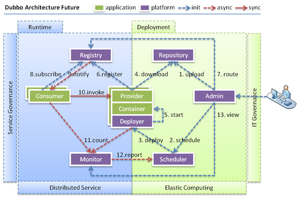

阅读[Dubbo 官方文档 2.7](https://dubbo.apache.org/zh/docs/v2.7/)版本笔记。

# 背景

## 演进：

1. 单体：所有功能都在一起，减少部署节点和成本。此时，用于减少 CRUD 工作量的 ORM 框架是关键。
2. 垂直：将应用拆成几个互补相关的应用，已提升效率。此时，用于加速前端页面开发的 Web 框架（MVC）是关键。
3. 分布式：垂直应用变多，应用间交叉不可避免，将核心业务抽取出来，作为独立的服务，逐渐形成稳定的服务中心，是前端应用能更快相应多变的市场需求。此时，用于提高业务复用及整合分布式服务框架（RPC）是关键。
4. 流动计算：当服务越来越多，容量的评估，小服务资源的浪费等问题逐渐显现，此时需增加一个调度中心基于访问压力实时管理集群容量，提高集群利用率。此时，用于提高机器利用率的资源调度和治理中心(SOA)是关键。

## 问题：

在大规模服务化之前，应用通过配置管理服务间调用，通过 F5 等硬件进行负载均衡。随着服务越来越多，服务间调用越来越多，带来了以下问题：

1. URL 配置管理变得困难，F5 硬件负责均衡单点压力也越来越大 --> 配置中心、负载均衡、容错
2. 服务间依赖复杂，不能完整描绘应用的架构关系 --> 链路追踪
3. 服务的容量难以估计 --> 容量计算、监控

## Dubbo 解决方案

### 连通性：

1. 注册中心
   1. 注册中心、服务方、消费方三者均为长链接
   2. 注册中心通过长链接感知到服务方下线后，立刻推送给消费方
   3. 服务方启动时注册一次，注册中心压力小
   4. 消费方本地缓存提供者列表，注册中心宕机不影响调用
   5. 注册中心可选，服务方、消费方可以直连
2. 监控中心
   1. 统计先在应用内存汇总后每分钟一次发送到监控中心
   2. 服务方统计不带网络开销的调用时间
   3. 消费方统计带网络消耗的调用时间
   4. 监控中心可选

### 健壮性

1. 注册中心
   1. 对等集群，任意宕机自动切换
   2. 全部宕机，消费者可使用本地缓存
   3. 数据库宕机后可以使用缓存继续提供服务，但不处理注册新服务
2. 服务方
   1. 无状态，任意宕机无影响
   2. 全部宕机，消费者将无法使用，并无限次重连等待恢复
3. 监控中心
   1. 宕机之丢失部分数据，不影响使用

### 伸缩性

1. 注册中心对等集群，客户端可发现新的注册中心
2. 服务方无状态，可动态调整数量，注册中心将变动推送消费者

# 服务化最佳实践

## 分包

建议将服务接口、服务模型、服务异常等均放在 API 包中，因为服务模型和异常也是 API 的一部分，这样做也符合分包原则：重用发布等价原则(REP)，共同重用原则(CRP)。如果需要，也可以考虑在 API 包中放置一份 Spring 的引用配置，这样使用方只需在 Spring 加载过程中引用此配置即可。配置建议放在模块的包目录下，以免冲突，如：com/alibaba/china/xxx/dubbo-reference.xml。

## 粒度

服务接口尽可能大粒度，每个服务方法应代表一个功能，而不是某功能的一个步骤，否则将面临分布式事务问题，Dubbo 暂未提供分布式事务支持。

服务接口建议以业务场景为单位划分，并对相近业务做抽象，防止接口数量爆炸。

不建议使用过于抽象的通用接口，如：Map query(Map)，这样的接口没有明确语义，会给后期维护带来不便。

## 兼容性

服务接口增加方法，或服务模型增加字段，可向后兼容，删除方法或删除字段，将不兼容，枚举类型新增字段也不兼容，需通过变更版本号升级。

## 枚举值

如果是完备集，可以用 Enum，比如：ENABLE, DISABLE。

如果是业务种类，以后明显会有类型增加，不建议用 Enum，可以用 String 代替。

如果是在返回值中用了 Enum，并新增了 Enum 值，建议先升级消费方，这样服务提供方不会返回新值。

如果是在传入参数中用了 Enum，并新增了 Enum 值，建议先升级服务提供方，这样消费方不会传入新值。

## 序列化

服务参数及返回值建议使用 POJO 对象，即通过 setter, getter 方法表示属性的对象。

服务参数及返回值不建议使用接口，因为数据模型抽象的意义不大，并且序列化需要接口实现类的元信息，并不能起到隐藏实现的意图。

服务参数及返回值都必须是传值调用，而不能是传引用调用，消费方和提供方的参数或返回值引用并不是同一个，只是值相同，Dubbo 不支持引用远程对象。

## 异常

建议使用异常汇报错误，而不是返回错误码，异常信息能携带更多信息，并且语义更友好。

如果担心性能问题，在必要时，可以通过 override 掉异常类的 fillInStackTrace() 方法为空方法，使其不拷贝栈信息。

查询方法不建议抛出 checked 异常，否则调用方在查询时将过多的 try...catch，并且不能进行有效处理。

服务提供方不应将 DAO 或 SQL 等异常抛给消费方，应在服务实现中对消费方不关心的异常进行包装，否则可能出现消费方无法反序列化相应异常。

## 调用

不要只是因为是 Dubbo 调用，而把调用 try...catch 起来。try...catch 应该加上合适的回滚边界上。

Provider 端需要对输入参数进行校验。如有性能上的考虑，服务实现者可以考虑在 API 包上加上服务 Stub 类来完成检验。

# 设计原则

## API 与 SPI 分离

框架或组件通常有两类客户，一个是使用者，一个是扩展者。API (Application Programming Interface) 是给使用者用的，而 SPI (Service Provide Interface) 是给扩展者用的。在设计时，尽量把它们隔离开，而不要混在一起。也就是说，使用者是看不到扩展者写的实现的。

## 实体域/服务域/会话域分离

实体域代表要操作的目标本身，是核心领域模型及其组成部分。

服务域是整个框架的核心功能，提供给用户使用的功能集，同时也负责实体域和会话域的生命周期管理， 比如 Spring 的 ApplicationContext，Dubbo 的 ServiceManager 等。服务域的对象通常会比较重，而且是线程安全的，并以单一实例服务于所有调用。
