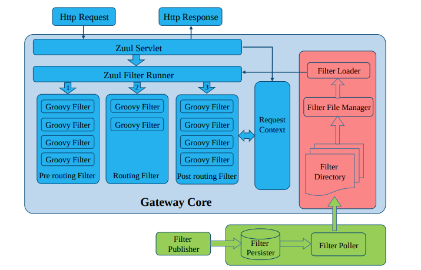
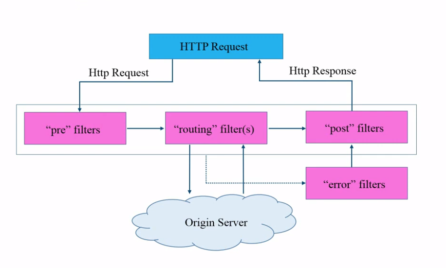
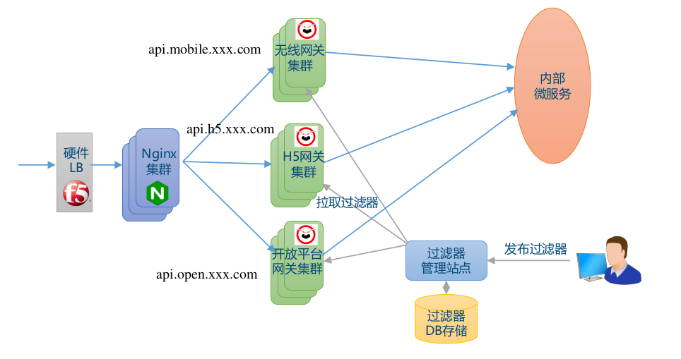
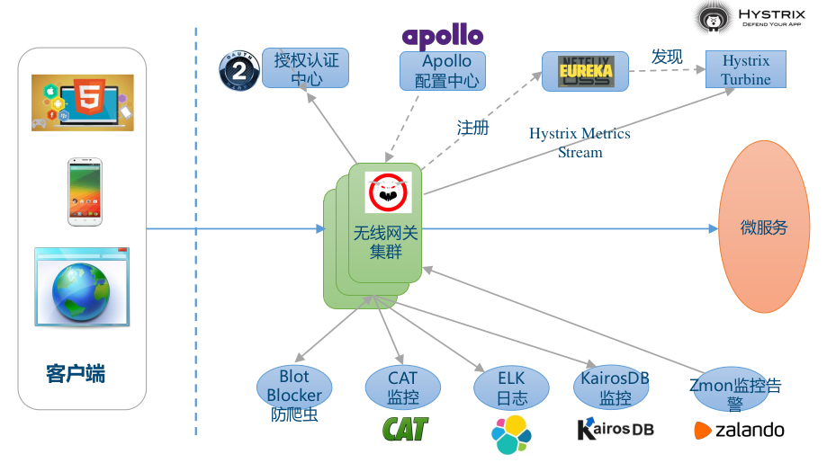
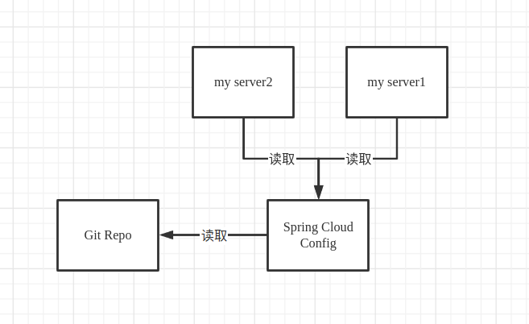

# 网关

## 基本功能

1. 单点入口
2. 路由转发
3. 限流熔断
4. 日志监控
5. 安全认证

## zuul

### 亮点：

1. 可动态发布的过滤器机制
2. 跨区域高可用

### 使用场景

1. 红绿部署
2. 开发者测试分支：线上测试，zuul 可以将特定流量路由到开发集群，用以线上调试
3. 埋点测试：线上测试，zuul 可以将特定流量路由到埋点集群，用以了解特定服务的性能
4. 调试路由：线上测试，zuul 可以将特定流量路由到调试集群，用以调试
5. 压力测试：复制用户流量到压测集群，同时丢弃响应
6. 粘性：将同一用户路由到一定的集群
7. 防爬防攻击
8. 健康检查和屏蔽坏节点

### 架构

- 绿色：过滤器管理模块
- 红色：过滤器加载模块
- 蓝色：网关过滤器运行模块

### 关键概念

- **类型 type：** 定义在路由过程中，过滤器被应用的阶段
- **执行顺序 execution order：** 在同一个 type 中，定义路由器的执行顺序
- **条件 criteria：** 过滤器被执行必须满足的条件
- **动作 action：** 如果满足条件，过滤器中将被执行的动作

### 部署

### 最佳实践

1. 异步 AsyncServlet 优化连接数
2. Apollo 配置中心集成动态配置
3. Hystrix 熔断限流（信号量隔离）
4. 连接池管理
5. CAT 和 Hystrix 监控
6. 过滤器调试技巧：groovy 需要的 jar 网关上必须要有；groovy 调试麻烦，调试时可以先写 java，然后改后缀
7. 网关无业务逻辑
8. 自助路由(定制扩展，把网关建立成平台)

# 配置中心

集中管理，带有版本控制的配置中心

